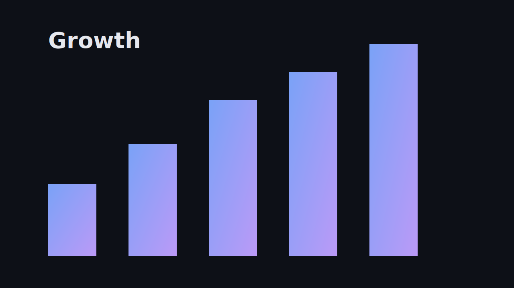

---
layout: title
---
# Q3 Review
## How we did, and what's next

A quick walk through the quarter — *June 2026*

---
layout: bullets
---
# What changed this quarter

- Shipped the new onboarding flow
- Killed three legacy services
- Cut p95 latency by **40%**
- Moved billing to the new platform
  - migrated 12k accounts
  - zero downtime

---
layout: lede
---
:::head
# This is a deliberately very long headline, written to wrap across four or five lines so it clearly outgrows its nominal slot and pushes the body down
:::
:::body
The `lede` layout puts the heading and this text in a logical **column**: a long title *grows* and pushes the body down instead of clipping, while a short title leaves it exactly where the grid placed it.
:::

---
layout: stat
---
:::head
# By the numbers
:::
:::figure
**142%**

of revenue target
:::
:::figure
**+18**

NPS points
:::
:::figure
**40%**

faster p95
:::

---
layout: statement
background: "var(--bg-2)"
slide-transition: fade
---
# The bet for Q4: make it *boringly reliable*.

::: notes
Land the reliability message here. This is the emotional pivot of the deck.
:::

---
layout: free
background: "linear-gradient(135deg, var(--bg-2), var(--bg))"
---
:::block at="x3 y3 x28 y16"
# Top-left
Placed by coordinates on the 64×36 grid.
:::
:::block at="x31 y7 x58 y20"
## Right block
A second region — `x31 y7 x58 y20`.
:::
:::block at="x11 y25 x50 y34"
### Centered-ish footer block
This is the escape hatch: explicit placement when a slide needs it.
:::

---
layout: bullets
reveal: true
transition: fade-up
---
# Revealed one at a time

- First, the problem
- Then the constraint
- Then the insight
- Finally, the fix

---
layout: bullets
---
# Mixed transitions

- Always here
- Fades in {+}
- Rises up {+ fade-up}
- Zooms in {+ zoom}
- Blurs into focus {+ blur}

---
layout: compare
---
:::head
# Before vs after
:::
:::left
### Before
- 3 services to deploy
- p95 ~ 800ms
- manual billing
:::
:::right
### After
- 1 service
- p95 ~ 480ms
- automated billing
:::

---
layout: code
---
# The whole deploy

```bash
ondeck build deck.md --pdf
rsync -a deck.pdf release@host:/srv/decks/
echo "shipped $(git rev-parse --short HEAD)"
```

---
layout: stat
---
:::head
# Reliability, in three numbers
:::
:::figure
**99.98%**

uptime
:::
:::figure
**0**

paging incidents
:::
:::figure
**12m**

mean time to deploy
:::

---
layout: table
highlight-col: 3
---
# Plans

| Feature   | Free | Pro  | Team |
| --------- | :--: | :--: | ---: |
| Seats     | 1    | 5    | ∞    |
| History   | 7d   | 1y   | 1y   |
| SSO       | —    | —    | ✓    |

---
layout: table
table-spacing: comfortable
table-style: stripes
---
# Roadmap

| Quarter | Theme        | Status      |
| ------- | ------------ | ----------- |
| Q1      | Onboarding   | Shipped     |
| Q2      | Billing      | In progress |
| Q3      | Mobile       | Planned     |
| Q4      | Enterprise   | Planned     |

---
layout: image
fit: full
---


---
layout: quote
---
:::body
The best way to predict the future is to invent it.
:::
:::cite
Alan Kay
:::

---
layout: media-split
---
:::body
# Built for the field

Crews see the next job, the route, and the parts list — before they leave the depot.
:::
:::media
{cover top}
:::

---
layout: media-split
media: right
---
:::body
# And on the right

Same layout, `media: right` — the image mirrors to the other side.
:::
:::media

:::

---
layout: raw
---
<div style="display:flex;height:100%;align-items:center;justify-content:center;gap:2rem;font-family:sans-serif">
  <div style="font-size:8vmin;font-weight:800;color:var(--accent)">100%</div>
  <div style="font-size:3vmin;max-width:14em;color:var(--fg)">
    A <code>raw</code> slide: when you need full control, you write the HTML directly.
  </div>
</div>
